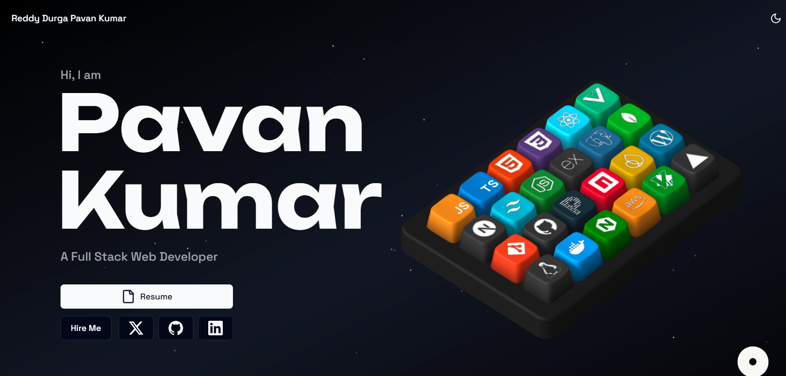

# 🚀 Pavan Chowdary 3D Portfolio

An interactive and modern 3D developer portfolio showcasing my projects, skills, experience, and achievements through immersive animations and a futuristic UI. Built with Next.js, React, TypeScript, and Spline, this portfolio highlights my passion for creating beautiful, high-performance web applications.

> ⭐ If you like this portfolio, consider giving the repository a star!

[](https://vercel.com/new/clone?repository-url=https://github.com/Pavanchowdary-1111/Pavanchowdary-3D-portfolio)



---

# ✨ Features

- 🎹 Interactive 3D Keyboard showcasing technical skills
- 🚀 Smooth GSAP & Framer Motion animations
- 🌌 Modern Space-themed UI
- 🌙 Light & Dark Mode
- 📱 Fully Responsive Design
- 📧 Contact Form powered by Resend
- ⚡ Optimized with Next.js 14
- 🎨 Modern UI using Tailwind CSS & Shadcn UI

---

# 🛠️ Tech Stack

| Layer | Technologies |
|-------|--------------|
| Framework | Next.js 14, React 18, TypeScript |
| Styling | Tailwind CSS, Shadcn UI, Aceternity UI |
| Animation | GSAP, Framer Motion |
| 3D | Spline |
| Backend | Resend |
| Extras | Lenis, Zod, next-themes |

---

# 🚀 Getting Started

## Clone Repository

```bash
git clone https://github.com/Pavanchowdary-1111/Pavanchowdary-3D-portfolio.git
cd Pavanchowdary-3D-portfolio
```

## Install Dependencies

```bash
npm install
```

or

```bash
pnpm install
```

## Environment Variables

Create a `.env.local` file.

```env
RESEND_API_KEY=your_resend_api_key
NEXT_PUBLIC_WS_URL=
UMAMI_DOMAIN=
UMAMI_SITE_ID=
```

## Run Development Server

```bash
npm run dev
```

Open

```
http://localhost:3000
```

---

# 🎨 Personalization

Update your information in

```
src/data/config.ts
```

Example

```ts
const config = {
  title: "Pavan Chowdary | Software Engineer",
  description: {
    long: "Portfolio of Reddy Durga Pavan Kumar showcasing MERN Stack, Frontend Development, ServiceNow Development, UI/UX Design, and award-winning projects.",
    short: "Software Engineer | MERN Stack Developer | ServiceNow Developer",
  },

  keywords: [
    "Pavan Chowdary",
    "MERN Stack",
    "React",
    "Next.js",
    "TypeScript",
    "Frontend Developer",
    "ServiceNow Developer",
    "Portfolio",
  ],

  author: "Reddy Durga Pavan Kumar",

  email: "your-email@example.com",

  site: "https://your-portfolio-link.com",

  githubUsername: "Pavanchowdary-1111",

  githubRepo: "Pavanchowdary-3D-portfolio",

  social: {
    linkedin: "https://linkedin.com/in/your-linkedin",
    github: "https://github.com/Pavanchowdary-1111",
    twitter: "",
    instagram: "",
    facebook: "",
  },
};
```

---

# 📂 Customize Portfolio

| File | Description |
|------|-------------|
| `src/data/config.ts` | Personal Information |
| `src/data/projects.tsx` | Projects |
| `src/data/constants.ts` | Skills & Experience |
| `public/assets/` | Images & Icons |

---

# ⌨️ Updating the 3D Keyboard

The interactive keyboard is created using **Spline**.

To customize:

1. Open `public/assets/skills-keyboard.spline`
2. Edit the keycap icons
3. Rename key objects to match entries in `src/data/constants.ts`
4. Export and replace the existing Spline file

---

# 🚀 Deployment

Deploy easily using **Vercel**.

1. Push your project to GitHub

```bash
git push -u origin main
```

2. Import the repository into Vercel.

3. Add your environment variables.

4. Deploy.

---

# 👨‍💻 About Me

Hi, I'm **Reddy Durga Pavan Kumar**.

I'm a passionate Software Engineer specializing in

- MERN Stack Development
- Frontend Development
- ServiceNow Development
- UI/UX Design
- REST API Integration

🏆 Achievements

- 🥇 Winner — AIGNITE 3.0 Hackathon
- 🥇 Winner — Utkarsh Hackathon
- 🥇 HackerRank 24-Hour Hackathon Winner
- 🥈 2nd Place — OOPS! Code It Right

---

# 🔗 Repository

https://github.com/Pavanchowdary-1111/Pavanchowdary-3D-portfolio

---

# 📄 License

This project is licensed under the MIT License.


